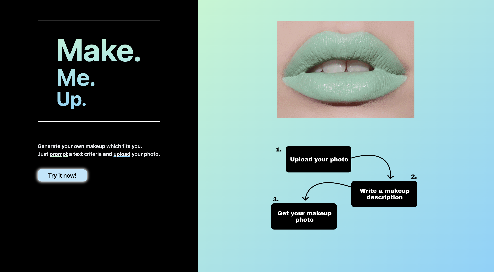
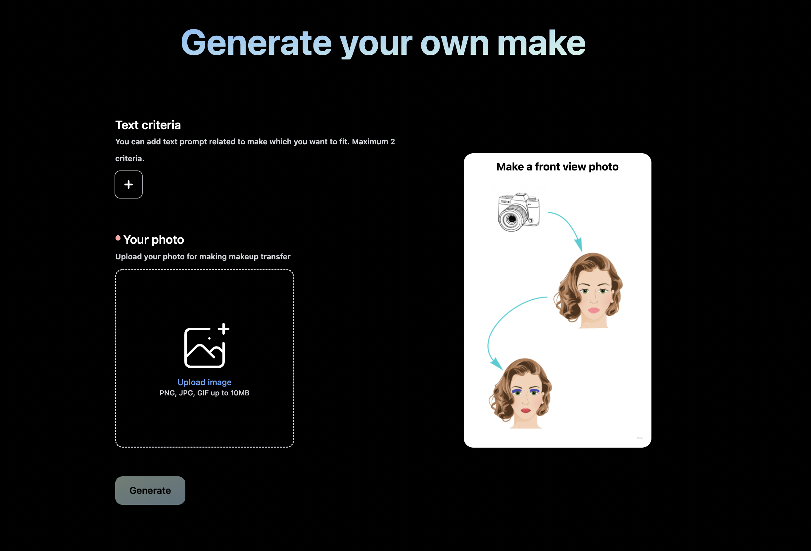

### **Make Me Up** – new tool for generating and transfering makeup conditioned by text request.




<br>

#### [Frontend](frontend) – **ReactJS** application with client side code for interaction with make-me-up API
#### [Server](server) – backend written on **Python** using FastAPI framework for serving requests.

<br>

### Running application:

Download models weights from [here]([https://drive.google.com/drive/folders/1SkxAHTa9XMiK328J1G_ejjEbFpPS4nWX?usp=sharing](https://drive.google.com/drive/folders/1SkxAHTa9XMiK328J1G_ejjEbFpPS4nWX?usp=sharing)) and then put them into [server/models](server/models) folder.

```yaml
    server:
        models:
            - PARSING.pth
            - SG3.pth
            - SSAT.pth
            - W_STDS.pt
        ... 
```
